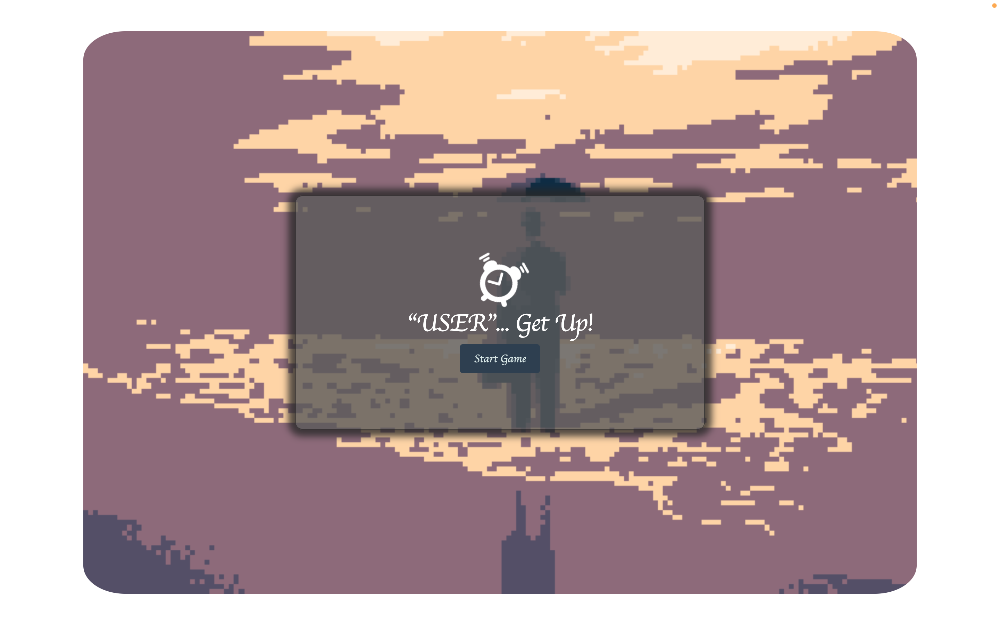
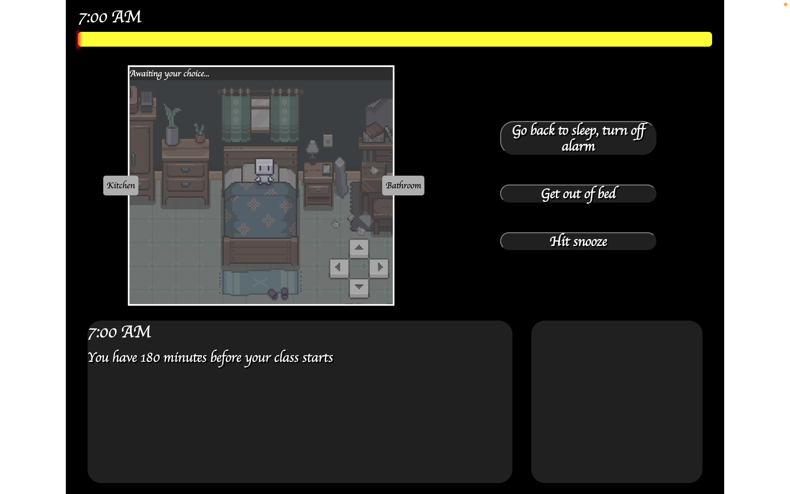
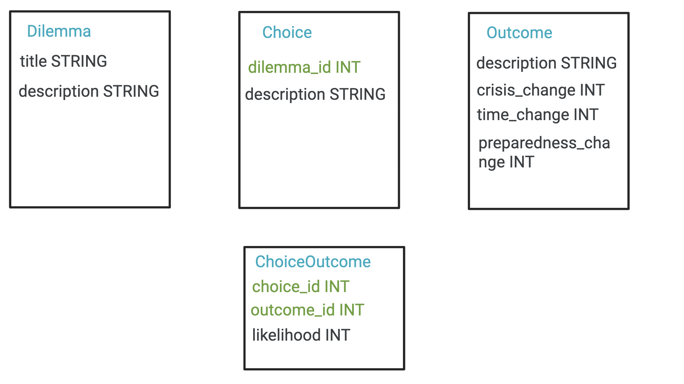
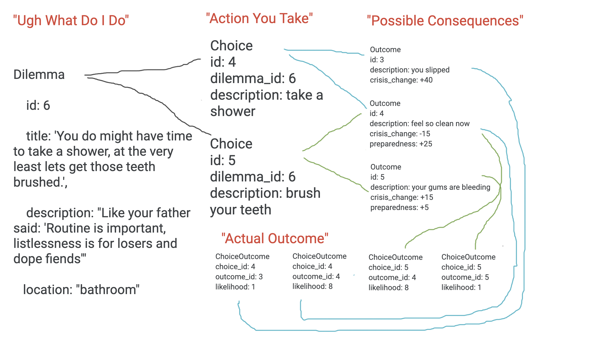
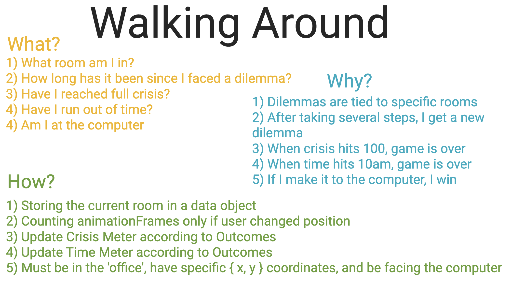

# Getting up RPG

First run the project at https://getting-up-rpg.herokuapp.com/

# Project Description

This is a game created that emulates the trials and tribulations that we all face after waking up and trying to make it to class on time.
The user is first promted to enter and submit their username and select start to begin the game.
The user takes the avatar of a despaired ghost, controlled by the d-pad or the arrow keys on their keyboard, navigating through the different rooms.
They will be given 3 options to start, that each will effect the crisis level, preparedness, and time left, all factors determining whether or not the user is ready for the start of class.
Throughout the game the user will be faced with random dilemnas, choices and outcomes.

# Technologies Used
* CSS
* JavaScript
* Handlebars
* HTML

# Concept

With this project our team desired to create a game that took into account a range of disruptive possibilities from benign ever day realities to comically absurd improbabilities that could disrupt the shared experience of a morning routine. 

This game was partially born of an appreciation of existentalist philosophy and how it relates to individual experience. The Jean-Paul Sartre quote ", all human actions are equivalent and all are on principle doomed to failure" worked as a catalyst for the game design which relied heavily on themes of both chaos and the absurdism of possibility. 

In these difficult times it is our hope that "Getting up." acts as a humorous distraction from the oft ridiculousness of the human condition. 

# User Story 
First you are brought to the landing page to enter your username

You choose to start game

You are given three options to begin the game

# Process Development

The backend connects to a MySQL database using Sequelize ORM. The five models involved are Dilemma, Choice, Outcome, ChoiceOutcome (pivot), and Quote. The following image shows the result tables and their column types. Quote model is not included in the image but has two columns 'author' and 'quote' in addition to primary key 'id', and both are strings. 

The relationships between the models are as follows:

- Dilemma hasMany Choices
- Choice belongsTo Dilemma
- Choice belongsToMany Outcomes (through ChoiceOutcome)
- Outcome belongsToMany Choices (through ChoiceOutcome)

The following image shows a flow chart of how the models are conceptually related to each other.

There is also a helper class that extends Model from Sequelize called JsonModel that adds the following methods to each model:

| Method Name | Type | Purpose |
| --- | --- | --- |
| getJson | async instance method | serializes the model into JSON |
| getJson | async static method | uses Sequelize Model's findAll method and maps the result array into JSON using the instance getJson method |
| getJsonByPk | async static method | uses Sequelize Model's findByPk method and returns the model as JSON, or null if the model does not exist |
| getRandomJson | async static method | uses Sequelize Model's findAll method then randomly selects one item from the result and returns it as JSON |

# Game Play and Logic

The following image shows the main concerns of tracking the game status and how they are accomplished.

# Future Development
With more time we would have liked a more polished UI
Better event triggers

# Credits 
* [David](https://github.com/codewizard-dt)
* [Troy](https://github.com/TEkdahl92)
* [Callie](https://github.com/calliebwill)
* [Neel](https://github.com/kakaralan)
* [Dawson](https://github.com/TheTrueMop)

# Sources
[MediaDevices.getUserMedia() - Web APIs | MDN](https://developer.mozilla.org/en-US/docs/Web/API/MediaDevices/getUserMedia) | [Luxon](https://cdnjs.com/libraries/luxon) | 

# MIT License

